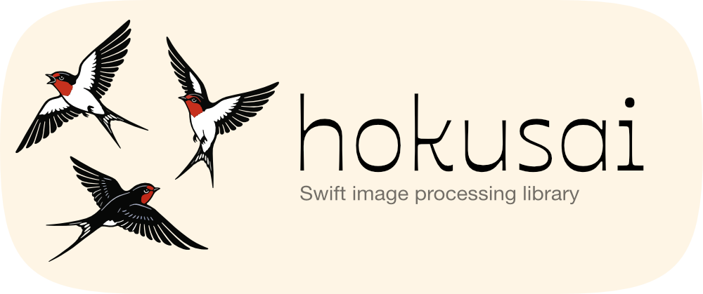

<p align="center">

</p>

# Hokusai

**Fast, libvips-powered image processing for Swift server-side applications**

Hokusai is a high-performance image processing library built on **libvips** for blazing-fast operations (resize, crop, rotate, convert, composite) and text rendering via **Pango/Cairo through libvips**.
Built for modern Swift server applications with async/await support, comprehensive error handling, and a clean, chainable API.

[](https://swift.org)
[](https://swift.org)
[](LICENSE)

## Key Features

- **High Performance** - Streaming processing with minimal memory footprint via libvips
- **Advanced Text** - Professional text rendering with Google Fonts, stroke, shadow, kerning, rotation
- **Format Support** - JPEG, PNG, WebP, AVIF, GIF, TIFF with quality control
- **Smart Resizing** - Multiple fit modes (cover, contain, fill) with intelligent cropping
- **Compositing** - Layer images with blend modes and opacity control
- **Chainable API** - Fluent interface for combining operations
- **Type Safe** - Full Swift concurrency support with comprehensive error types

## Use Cases

- Certificate and badge generation with custom text
- Social media image automation (Open Graph, Twitter Cards)
- E-commerce product image pipelines
- Avatar and thumbnail generation
- Watermarking and branding workflows

## Related Projects

- [hokusai-vapor](https://github.com/ivantokar/hokusai-vapor) - Vapor framework integration
- [hokusai-vapor-example](https://github.com/ivantokar/hokusai-vapor-example) - Complete demo app with web UI

## How It Works

Hokusai provides a unified Swift API backed by libvips for all operations, including text rendering.

## Installation

### Requirements

- Swift 6.0+
- macOS 13+ or Linux (Ubuntu/Debian tested)
- `pkg-config` plus the native libraries below

**macOS:**
```bash
brew install vips pkg-config
```

**Ubuntu/Debian:**
```bash
sudo apt update
sudo apt install libvips-dev pkg-config
```

### Swift Package Manager

Add to your `Package.swift`:

```swift
dependencies: [
    .package(url: "https://github.com/ivantokar/hokusai.git", from: "0.2.0")
]

targets: [
    .target(
        name: "YourTarget",
        dependencies: ["Hokusai"]
    )
]
```

## CLI

Hokusai ships with a first-party CLI target: `hokusai`.

### Run from source

```bash
swift run hokusai --help
swift run hokusai info
swift run hokusai inspect --input ./input.jpg
swift run hokusai resize --input ./input.jpg --output ./out.jpg --width 1200 --height 800 --fit cover
```

### Install via Homebrew (recommended for users)

Use a dedicated tap repository (recommended: `ivantokar/homebrew-tap`) with a `hokusai` formula.

```bash
brew tap ivantokar/homebrew-tap
brew install hokusai
hokusai --help
```

If you have not published the formula yet, use `swift run hokusai ...` until the tap is live.

## Quick Start

```swift
import Hokusai

// Initialize Hokusai (call once at app startup)
try Hokusai.initialize()
defer { Hokusai.shutdown() }

// Load an image
let image = try await Hokusai.image(from: "photo.jpg")

// Chain operations
let processed = try image
    .resize(width: 800)
    .rotate(angle: .degrees(90))
    .drawText(
        "Hello World",
        x: 100,
        y: 100,
        options: TextOptions(
            font: "/path/to/font.ttf",
            fontSize: 48,
            color: [255, 255, 255, 255],
            strokeColor: [0, 0, 0, 255],
            strokeWidth: 2.0
        )
    )

// Save result
try processed.toFile("output.jpg", quality: 85)
```

## API Documentation

### Initialization

```swift
// Initialize libvips backend
try Hokusai.initialize()

// Shutdown when done (call at app teardown)
Hokusai.shutdown()

// Get version info
print(Hokusai.vipsVersion)    // "8.15.1"
```

### Loading Images

```swift
// From file path
let image = try await Hokusai.image(from: "/path/to/image.jpg")

// From Data buffer
let data = try Data(contentsOf: url)
let image = try await Hokusai.image(from: data)
```

### Text Rendering

```swift
var textOptions = TextOptions()
textOptions.font = "/path/to/CustomFont.ttf"  // or "Arial" for system fonts
textOptions.fontSize = 96
textOptions.color = [0, 0, 128, 255]          // Navy blue (RGBA)
textOptions.strokeColor = [255, 255, 255, 255] // White outline
textOptions.strokeWidth = 2.0
textOptions.kerning = 1.5                      // Letter spacing
textOptions.rotation = 45.0                    // Rotate text 45°

let withText = try image.drawText(
    "Your Text Here",
    x: 200,
    y: 150,
    options: textOptions
)
```

### Resize Operations

```swift
// Resize to exact dimensions (ignores aspect ratio)
let resized = try image.resize(width: 800, height: 600)

// Resize to fit within dimensions (preserves aspect ratio)
let fitted = try image.resizeToFit(width: 800, height: 600)

// Resize to cover dimensions (crop to fill)
let covered = try image.resizeToCover(width: 800, height: 600)

// Advanced options
var options = ResizeOptions()
options.fit = .contain                // Fit mode: fill, inside, outside, cover, contain
options.kernel = .lanczos3            // Interpolation: nearest, linear, cubic, lanczos3
options.withoutEnlargement = true     // Don't upscale
options.background = [0, 0, 0, 255]   // Background color for contain mode

let resized = try image.resize(width: 800, height: 600, options: options)
```

### Crop Operations

```swift
// Manual crop
let cropped = try image.crop(x: 100, y: 100, width: 500, height: 400)

// Smart crop (attention detection)
let smartCropped = try image.smartCrop(
    width: 400,
    height: 400,
    position: .center  // or .top, .bottom, .left, .right, etc.
)
```

### Rotation

```swift
// Fast 90° rotations
let rotated90 = try image.rotate(angle: .degree90)
let rotated180 = try image.rotate(angle: .degree180)
let rotated270 = try image.rotate(angle: .degree270)

// Arbitrary angle
let rotated = try image.rotate(
    angle: .degrees(45),
    background: [255, 255, 255, 255]  // White background
)

// Flip
let flipped = try image.flip(direction: .horizontal)  // or .vertical, .both
```

### Format Conversion

```swift
// Convert and save
try image.toFile("output.png")
try image.toFile("output.webp", quality: 80)
try image.toFile("output.avif", quality: 75)

// Convert to buffer
let jpegData = try image.toBuffer(format: "jpeg", quality: 85)
let pngData = try image.toBuffer(format: "png", quality: 9)
let webpData = try image.toBuffer(format: "webp", quality: 80)
```

AVIF/HEIF output requires libvips built with libheif support.

### Composite / Watermark

```swift
let base = try await Hokusai.image(from: "photo.jpg")
let overlay = try await Hokusai.image(from: "watermark.png")

let options = CompositeOptions(mode: .over, opacity: 0.6)
let composited = try base.composite(
    overlay: overlay,
    x: 16,
    y: 16,
    options: options
)

try composited.toFile("watermarked.png")
```

### Metadata

```swift
let metadata = try image.metadata()

print(metadata.width)      // 3206
print(metadata.height)     // 2266
print(metadata.channels)   // 4 (RGBA)
print(metadata.hasAlpha)   // true
print(metadata.format)     // Optional(ImageFormat.jpeg) (may be nil)
```

### Direct Property Access

```swift
let width = try image.width
let height = try image.height
let channels = try image.bands
let hasAlpha = try image.hasAlpha
```

## Architecture

### Single Backend

```
┌─────────────────────────────────────┐
│            HokusaiImage             │
│      (Unified API, libvips only)    │
└──────────────────┬──────────────────┘
                   │
            ┌──────▼──────┐
            │ VipsBackend │
            │  (libvips)  │
            └─────────────┘
                   │
            ┌──────▼──────┐
            │ Resize/Crop │
            │ Rotate/Text │
            │ Convert/Comp│
            └─────────────┘
```

All operations are executed by libvips, with text rendering powered by Pango/Cairo through `vips_text`.

### Thread Safety

All operations are thread-safe using NSLock:
```swift
let operations = (0..<10).map { i in
    Task {
        let image = try await Hokusai.image(from: "input.jpg")
        let processed = try image
            .resize(width: 800)
            .drawText("Frame \(i)", x: 10, y: 10)
        try processed.toFile("output_\(i).jpg")
    }
}
await withTaskGroup(of: Void.self) { group in
    operations.forEach { group.addTask { try? await $0.value } }
}
```

## Performance

### Benchmarks (measured with `hokusai` CLI)

Environment:
- Apple M4 Pro
- macOS 26.5 (build 25F5053d)
- release binary build

Method:
- warmup: 5 runs
- measured iterations: 20 runs

Input: `certifcate.png` (3206x2266, RGBA)

| Case | Mean | P95 | Ops/s |
| --- | ---: | ---: | ---: |
| resize:1200x800 | 4.79 ms | 5.99 ms | 208.94 |
| convert:webp:q80 | 203.20 ms | 208.16 ms | 4.92 |
| rotate:33 | 35.56 ms | 38.90 ms | 28.12 |
| text:stroke-shadow | 105.26 ms | 107.66 ms | 9.50 |

Text-only benchmark on the same input:
- mean: 99.66 ms
- median: 98.05 ms
- p95: 103.16 ms
- ops/s: 10.03

Note: these are measured reference values on one machine, not universal performance guarantees.
Use `hokusai benchmark suite` / `hokusai benchmark op` to reproduce on your hardware.

### Memory Management

- libvips processes images in chunks (streaming)
- Typical memory usage: 1.5x - 2x of output image size
- Automatic cleanup via `deinit`
- No manual memory management required

## Advanced Usage

### Custom Font Loading

```swift
// System fonts (by name)
let options1 = TextOptions(font: "Arial")
let options2 = TextOptions(font: "Helvetica-Bold")

// Custom fonts (by path)
let options3 = TextOptions(font: "/usr/share/fonts/truetype/MyFont.ttf")
let options4 = TextOptions(font: "./assets/CustomFont.otf")

// On Linux, use fontconfig names
let options5 = TextOptions(font: "DejaVu Sans")
let options6 = TextOptions(font: "Liberation Serif")
```

### iOS Client Example

Hokusai runs on macOS/Linux (libvips) and is intended for server use. iOS apps should call a HokusaiVapor server instead.

This example calls the HokusaiVapor `/api/images/convert` endpoint from an iOS app:

```swift
import UIKit

func convertToWebP(_ image: UIImage, baseURL: URL) async throws -> UIImage {
    guard let data = image.jpegData(compressionQuality: 0.9) else {
        throw URLError(.cannotDecodeRawData)
    }

    var components = URLComponents(
        url: baseURL.appendingPathComponent("api/images/convert"),
        resolvingAgainstBaseURL: false
    )
    components?.queryItems = [
        URLQueryItem(name: "format", value: "webp"),
        URLQueryItem(name: "quality", value: "80")
    ]

    guard let url = components?.url else {
        throw URLError(.badURL)
    }

    var request = URLRequest(url: url)
    request.httpMethod = "POST"
    request.setValue("image/jpeg", forHTTPHeaderField: "Content-Type")
    request.httpBody = data

    let (responseData, _) = try await URLSession.shared.data(for: request)
    guard let processed = UIImage(data: responseData) else {
        throw URLError(.cannotDecodeRawData)
    }

    return processed
}
```

### Error Handling

```swift
do {
    let image = try await Hokusai.image(from: "input.jpg")
    let processed = try image.resize(width: 800)
    try processed.toFile("output.jpg")
} catch HokusaiError.fileNotFound(let path) {
    print("Image not found: \(path)")
} catch HokusaiError.loadFailed(let message) {
    print("Failed to load image: \(message)")
} catch HokusaiError.vipsError(let message) {
    print("libvips error: \(message)")
} catch {
    print("Unexpected error: \(error)")
}
```

## Platform-Specific Notes

### macOS
- Install libvips via Homebrew (`brew install vips`)

### Linux (Ubuntu/Debian)
- Install libvips via apt (`sudo apt install libvips-dev`)
- Use fontconfig font names or absolute paths

### Docker
See the [hokusai-vapor-example](https://github.com/ivantokar/hokusai-vapor-example) demo app for a complete Docker deployment example.

## Troubleshooting

### pkg-config errors

**macOS:**
```bash
export PKG_CONFIG_PATH=/opt/homebrew/lib/pkgconfig
```

**Linux:**
```bash
export PKG_CONFIG_PATH=/usr/lib/$(uname -m)-linux-gnu/pkgconfig
```

### Font not found errors

**Verify font installation:**
```bash
# List available fonts
fc-list | grep "YourFont"

# Update font cache
fc-cache -f -v
```

**Use absolute paths:**
```swift
// Instead of font name
textOptions.font = "MyCustomFont"

// Use absolute path
textOptions.font = "/usr/share/fonts/truetype/MyCustomFont.ttf"
```

## Testing

```bash
swift build
swift test
```

Tests are implemented with `XCTest` and run with standard SwiftPM tooling.
The package keeps a minimal `swift-testing` dependency to support toolchains where SwiftPM still expects the `Testing` module at test runtime.

## Releases

Hokusai follows semantic version tags in the format `vX.Y.Z`.

- Releases are managed manually via semantic version tags (`vX.Y.Z`).
- This repository intentionally does not run GitHub Actions workflows to reduce OSS costs.
- Human-curated release notes are tracked in [CHANGELOG.md](CHANGELOG.md).

## Swift Package Index

This repository is structured to be compatible with Swift Package Index:

- semantic version tags (`vX.Y.Z`)
- local validation with `swift build` and `swift test`
- clear installation/usage docs in this README

Recommended next step when API docs grow: add a lightweight DocC catalog at `Sources/Hokusai/Hokusai.docc` and let SPI host the generated documentation.

## Contributing

Contributions are welcome! Please:
1. Fork the repository
2. Create a feature branch
3. Add tests for new functionality
4. Ensure all tests pass
5. Submit a pull request

## License

MIT License - see [LICENSE](LICENSE) file for details.

## Credits

Built with:
- [libvips](https://www.libvips.org/) - Fast image processing library
- Inspired by [sharp](https://sharp.pixelplumbing.com/) (Node.js)
