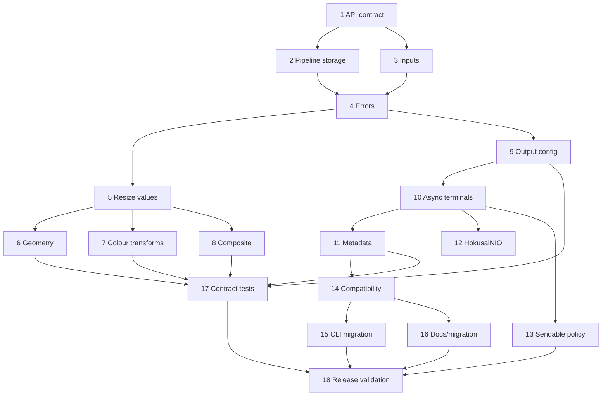

# Sharp-inspired Swift-native DX — implementation plan

## 1. Executive summary

Hokusai should become the idiomatic Swift façade for libvips: a small, fluent,
immutable image pipeline with familiar Sharp concepts (input → transforms →
configured encoder → terminal output), not a Swift spelling of C/libvips.

The recommended main type remains `Hokusai`. It changes from a static namespace
to a `public struct Hokusai: Sendable` representing an immutable processing
recipe. A call such as `Hokusai(data:)` builds the source node synchronously;
transform methods synchronously return a derived value; `data()` and `write(to:)`
are async terminal operations that evaluate the recipe on a dedicated bounded
executor. Copying or assigning the value is safe reuse, so no Sharp-style
`clone()` is necessary.

This is a **1.0 major-version redesign**. The current public surface is useful
proof that the libvips adapter works, but it is inconsistent: `Hokusai` is a
namespace, `HokusaiImage` is the actual handle, `toFormat` is a no-op, loading
and evaluation are mixed, and public options leak adapter-era concerns.

Copy from Sharp: the mental model, operation names where they are established,
resize defaults, output configuration separated from output, and recipe-led
documentation. Do not copy: a mutable builder, JavaScript option bags, callback
APIs, implicit stream semantics, or unchecked runtime configuration on every
instance.

The milestone covers encoded `Data` and file `URL` input, core transforms,
typed encoders, metadata, async terminal output, resource/execution policy,
migration, CLI migration, tests, and DocC. Streaming input/output, animations,
storage, middleware, proxies, presets, and broad operation parity are deferred.

Authoritative constraints: libvips is demand-driven and threaded; immutable
`VipsImage`s may be read from multiple threads after single-threaded startup,
but libvips errors use a shared error buffer and drawing operations mutate their
input. The implementation must serialize startup/error capture at the adapter
boundary and never expose mutable native objects in the standard API. See the
[libvips threading guide](https://www.libvips.org/API/current/using-threads.html),
[evaluation model](https://www.libvips.org/API/8.17/how-it-works.html),
[Sharp output API](https://sharp.pixelplumbing.com/api-output/), and the
[Swift API Design Guidelines](https://www.swift.org/documentation/api-design-guidelines/).

## 2. Current-state audit

### Current surface and architecture

| Area | Current implementation | Assessment |
| --- | --- | --- |
| Entry point | `Hokusai` static namespace in `Sources/Hokusai/Hokusai.swift` | Automatic initialization and `Data`/path loading are useful, but a namespace cannot model a user pipeline. |
| Pipeline | `HokusaiImage` final class in `Sources/Hokusai/HokusaiImage.swift` | Each operation returns a new image; this is the right semantic foundation, but reference identity and `@unchecked Sendable` are public implementation details. |
| Adapter | `VipsBackend` plus `CVips/shim.h` | Correct place for ownership and C calls, but public errors and options are shaped around it. |
| Loading | `image(from: String/Data, options: LoadOptions)` | The loading methods are now honestly synchronous. `String` paths and public `AccessMode` should not be the primary DX. |
| Geometry | `Resize`, `Crop`, `Rotate`, `Thumbnail` extensions | Good initial coverage, but inconsistent labels (`crop` vs Sharp’s `extract`), duplicate resize entry points, and unchecked `Int32` conversions outside thumbnails. `trim` is a no-op. |
| Output | `SaveOptions`, `toFile`, `toBuffer`, `toFormat` | `toFormat` returns `self` without storing configuration; file and buffer encoders differ; options mix formats; evaluation is synchronous. |
| Composition/text | `Composite.swift`, `Text.swift` | Simple image overlay works. Text is useful but not a first-milestone public focus; its array colours and very broad option set need redesign. |
| Metadata | `ImageMetadata` | Typed shape is promising, but `metadata()` currently returns many fields as `nil` despite `extendedMetadata()` finding native values. |
| CLI | `Sources/HokusaiCLI/HokusaiCLI.swift` | It couples directly to legacy load/transform/save APIs and explicitly initializes/shuts down the runtime per command. |
| Tests/docs | `Tests/HokusaiTests`, `README.md`, `docs/LibvipsIntegrationNotes.md` | Thumbnail/lifecycle coverage is a strong start (62 tests), but no API-contract suite, output compatibility matrix, cancellation tests, or DocC catalog. |

### Strengths to preserve

- A libvips-only backend, lazy graph construction, copied buffer inputs, and the
  8.9+ version floor.
- `ThumbnailArguments` as one validation/mapping boundary and realistic image
  fixtures in `Tests/HokusaiTests/Fixtures`.
- The existing immutable-operation behavior: do not turn this into a mutable
  Sharp clone.
- `ResizeFit`, `Position`, kernels, compositing, EXIF-aware thumbnail behavior,
  and the CLI as behavioural test coverage.

### Accidental complexity and migration risks

- `HokusaiImage` exposes lifecycle and native-handle policy through
  `@unchecked Sendable`; `Hokusai.shutdown()` is documented as unsafe with live
  images yet cannot enforce it. `LifecycleConcurrencyTests` deliberately omits
  shutdown testing.
- `HokusaiError` mixes coarse API categories with raw `vipsError`; thumbnail
  file/buffer failures and existing-image failures have different categories.
- `ResizeOptions` duplicates width/height supplied to `resize`; `background` and
  all text colours are `[Double]`; `Position` combines gravity and smart-crop
  policy.
- `ImageFormat` lists input-only formats (`pdf`, `svg`) alongside writable
  formats. `toFormat` claims configuration but does not configure anything.
- Existing source code importing `HokusaiImage`, calling static loaders,
  `toFile(String)`, `toBuffer(options:)`, `crop`, `flip(direction:)`, or async
  old loaders will need a migration. The 0.3.0 changelog already contains one
  breaking API correction, so the redesign should not pretend to be additive.

## 3. Sharp-to-Hokusai API map

| Sharp concept/API | Proposed Hokusai API | Same semantics? | Swift-specific difference | Milestone |
| --- | --- | ---: | --- | --- |
| `sharp(input)` | `Hokusai(data:)`, `Hokusai(url:)` | Mostly | Typed initializers; no string-path primary API | Core |
| `clone()` | Value copy; no method | Yes for independent branching | Immutable values share immutable storage safely | Core |
| `resize(w,h,options)` | `.resize(width:height:fit:position:...)` | Yes | Labels and typed enums; `ResizeOptions` overload for reuse | Core |
| `rotate()` / `rotate(deg)` | `.autoOrient()` / `.rotate(by:)` | Yes | Distinguishes EXIF intent from angle explicitly | Core |
| `flip()` / `flop()` | `.flip()` / `.flop()` | Yes | No direction enum on the happy path | Core |
| `extract()` | `.extract(x:y:width:height:)` | Yes | Replaces ambiguous `crop` | Core |
| `extend()` | `.extend(to:anchor:background:)` | Mostly | Typed `Color` and `CanvasAnchor` | Core |
| `trim()` | `.trim(options:)` | Yes | Implement, do not retain current no-op | Core |
| `blur()` / `sharpen()` | `.blur(sigma:)` / `.sharpen(options:)` | Mostly | Start with documented safe subset | Core |
| `flatten()` | `.flatten(background:)` | Yes | `Color` rather than array | Core |
| `composite()` | `.composite(_:)` | Mostly | `CompositeLayer` value supports `Hokusai`, `Data`, or URL source | Core |
| colour/channel ops | `.grayscale()`, `.tint(_:)`, `.normalize()`, `.convert(to:)`, `.ensureAlpha()` | Mostly | Small curated set; raw band math deferred | Core |
| `jpeg/png/webp/avif` | `.jpeg(...)`, `.png(...)`, `.webp(...)`, `.avif(...)` | Yes | Immutable encoder configuration values | Core |
| `toFormat` | `.encode(as:)` | Yes | Explicit generic alternative to convenience encoders | Core |
| `toBuffer()` / `toFile()` | `try await .data()` / `.write(to:)` | Yes | `URL` primary, async/throwing, returns `OutputInfo` | Core |
| `metadata()` | `.metadata()` | Mostly | Typed `ImageMetadata`, documented as header/pipeline metadata | Core |
| Node streams | `AsyncSequence` input/output | No | Deferred until cancellation/backpressure policy exists | Later |
| raw pixel input/output | `RawPixels` | Partial | Explicit format/stride required | Later |
| broad Sharp encoder matrix | curated formats | No | Runtime capability reporting; only supported tested encoders | Later |

## 4. Proposed public API specification

### Main pipeline, inputs, and ownership

```swift
public struct Hokusai: Sendable {
    public init(data: Data, options: InputOptions = .init()) throws
    public init(url: URL, options: InputOptions = .init()) throws

    @available(*, deprecated, message: "Use init(url:)")
    public init(path: String, options: InputOptions = .init()) throws

    public func metadata() throws -> ImageMetadata
    public func data() async throws -> Output
    @discardableResult public func write(to url: URL) async throws -> OutputInfo
}

public struct InputOptions: Sendable {
    public var failOn: DecodeFailureLevel
    public var page: Int?
    public var pages: Int?
}

public struct Output: Sendable {
    public let data: Data
    public let info: OutputInfo
}
```

`Hokusai` is a small immutable value containing a reference to immutable,
reference-counted adapter storage plus immutable transform/encoder settings.
Copying it means a safe branch of the same input recipe; transforms return a new
value and never alter other copies. There is no `clone()` in v1 because it adds
no semantics beyond assignment. The public type may use an internal
`@unchecked Sendable` storage only after adapter stress tests prove that all
exposed operations are read-only and ownership is guarded. The native pointer,
generic native operation invocation, and `VipsImage` never appear in standard
public signatures.

`Data` and `URL` are the core inputs. `URL` must be a file URL; reject other
schemes as `.invalidInput`. A string-path initializer is a deprecated migration
shim. Existing `Hokusai` values can be passed directly to `CompositeLayer`;
there is no separate public image-object initializer. Raw pixels require a
future `RawPixels` declaration with width, height, channel layout, bit depth,
and row stride. Streams and `AsyncSequence<UInt8>` are deferred because a
correct implementation needs bounded buffering, cancellation, and format
detection policy.

SwiftNIO support is a separate `HokusaiNIO` product, so the base package does
not impose NIO. It adds `init(buffer: ByteBuffer, options:)` and
`Output.byteBuffer` without unsafe lifetime borrowing; bytes are copied or held
by a documented owning storage object.

### Transforms and resize

```swift
public extension Hokusai {
    func autoOrient() throws -> Self
    func resize(width: Int? = nil, height: Int? = nil,
                fit: ResizeFit = .cover, position: ResizePosition = .center,
                kernel: ResizeKernel = .lanczos3,
                withoutEnlargement: Bool = false,
                withoutReduction: Bool = false,
                background: Color = .transparent) throws -> Self
    func resize(_ options: ResizeOptions) throws -> Self
    func rotate(by degrees: Double, background: Color = .transparent) throws -> Self
    func flip() throws -> Self
    func flop() throws -> Self
    func extract(x: Int, y: Int, width: Int, height: Int) throws -> Self
    func extend(to size: ImageSize, anchor: CanvasAnchor = .center,
                background: Color = .transparent) throws -> Self
    func trim(options: TrimOptions = .init()) throws -> Self
    func blur(sigma: Double = 1) throws -> Self
    func sharpen(_ options: SharpenOptions = .init()) throws -> Self
    func flatten(background: Color = .white) throws -> Self
    func grayscale() throws -> Self
    func tint(_ color: Color) throws -> Self
    func normalize() throws -> Self
    func convert(to space: ColorSpace) throws -> Self
    func ensureAlpha(_ alpha: Double = 1) throws -> Self
    func removeAlpha(background: Color = .white) throws -> Self
}

public enum ResizeFit: Sendable { case cover, contain, fill, inside, outside }
public enum ResizePosition: Sendable {
    case center, north, south, east, west
    case northWest, northEast, southWest, southEast
    case attention, entropy
}
public struct ResizeOptions: Sendable { /* mirrors labelled resize parameters */ }
public struct Color: Hashable, Sendable {
    public init(red: Double, green: Double, blue: Double, opacity: Double = 1)
    public static let transparent: Self
    public static let white: Self
}
```

All dimensions and finite numeric values validate at the public boundary, before
any `Int32` conversion. Width-only and height-only resize preserve aspect ratio.
`cover`/`contain` with two dimensions use `ResizePosition`; `.attention` and
`.entropy` are valid only for crop-capable `cover`. `fill` ignores aspect ratio,
`inside` and `outside` preserve it without crop, and `contain` pads with the
specified colour. Constraints that make an exact target impossible return the
result required by the chosen fit and are documented/tested rather than silently
switching policy.

Transform methods build libvips graph nodes synchronously and can throw
validation or graph-construction errors. They do not perform terminal encoding
or filesystem I/O. Ordering is source order and observable: e.g.
`autoOrient().resize(...).composite(...)` is not reordered. The optimizer may
fuse equivalent native nodes only when the output is identical.

### Compositing, encoding, outputs, and metadata

```swift
public struct CompositeLayer: Sendable {
    public init(_ image: Hokusai, x: Int = 0, y: Int = 0,
                blend: BlendMode = .over, opacity: Double = 1)
    public init(data: Data, x: Int = 0, y: Int = 0,
                blend: BlendMode = .over, opacity: Double = 1) throws
}

public extension Hokusai {
    func composite(_ layers: [CompositeLayer]) throws -> Self
    func encode(as format: OutputFormat) throws -> Self
    func jpeg(quality: Int = 80, progressive: Bool = false) throws -> Self
    func png(compressionLevel: Int = 6, progressive: Bool = false) throws -> Self
    func webp(quality: Int = 80, effort: Int = 4, lossless: Bool = false) throws -> Self
    func avif(quality: Int = 50, effort: Int = 4, lossless: Bool = false) throws -> Self
    func preserveMetadata() throws -> Self
    func removeMetadata() throws -> Self
}

public struct ImageMetadata: Sendable, Equatable {
    public let format: ImageFormat?
    public let width: Int
    public let height: Int
    public let channels: Int
    public let hasAlpha: Bool
    public let colorSpace: ColorSpace?
    public let orientation: Orientation?
    public let density: ImageDensity?
    public let pages: Int?
    public let pageHeight: Int?
    public let isAnimated: Bool
    public let exif: Data?
    public let iccProfile: Data?
    public let xmp: Data?
}
```

`jpeg`, `png`, `webp`, `avif`, and `encode(as:)` are configuration transforms:
they return a new pipeline and validate only options relevant to their format.
Calling a second encoder replaces the prior encoder. If none is selected,
`data()` fails with `.invalidOption`; `write(to:)` infers a supported format from
its file extension, otherwise fails rather than guessing. The first milestone
supports only encoders compiled into the installed libvips and exposes
`Hokusai.capabilities` for runtime feature checks.

`metadata()` reads source/current pipeline header metadata and is synchronous;
its documentation must state that it can cause header decode but not a full
pixel render. Metadata preservation is explicit: output defaults are selected
and documented consistently (recommend removal by default, matching Sharp),
with `preserveMetadata` and future targeted edit APIs.

### Errors, execution, and advanced API

```swift
public enum HokusaiError: Error, Sendable, LocalizedError {
    case invalidInput(String)
    case invalidOption(name: String, reason: String)
    case unsupported(feature: String)
    case decode(FailureContext)
    case transform(FailureContext)
    case encode(FailureContext)
    case io(url: URL, operation: FileOperation, reason: String)
    case cancelled
    case runtime(FailureContext)
}
public struct FailureContext: Sendable, Equatable {
    public let operation: String
    public let message: String
}
```

Adapter code captures and clears libvips diagnostics immediately behind its own
synchronization boundary, then maps them to stable categories plus useful
context. Raw C types, opaque error-buffer dumps, and C return codes stay
internal.

Terminals run blocking libvips work on a package-owned bounded executor rather
than the cooperative Swift executor or a `Task.detached` per call. Cancellation
is checked before queueing and before evaluation; an in-progress native encoder
cannot be claimed cancellable until a verified libvips cancellation mechanism
exists. Concurrent terminal evaluation and reuse are supported for immutable
pipelines. Global libvips concurrency is configured once through an advanced
process configuration API before first use, not a mutable per-image property.

No generic native invocation ships in the first milestone. A follow-up
`HokusaiAdvanced` product may expose an explicitly unsafe/availability-bound
adapter protocol for library authors, with no `Vips*` names in the core module.

### Representative workflows

```swift
// 1. Uploaded bytes → WebP response
let output = try await Hokusai(data: upload)
    .autoOrient().resize(width: 1200, height: 630, fit: .cover, position: .attention)
    .webp(quality: 82).data()

// 2. Avatar
let avatar = try await Hokusai(data: input)
    .resize(width: 400, height: 400, fit: .cover, position: .attention)
    .jpeg(quality: 86).data()

// 3. Social card
let logo = try Hokusai(url: logoURL).resize(width: 240)
let card = try await Hokusai(url: photoURL)
    .resize(width: 1200, height: 630, fit: .cover)
    .composite([CompositeLayer(logo, x: 48, y: 48, opacity: 0.9)])
    .png().data()

// 4. File → WebP
try await Hokusai(url: inputURL).webp(quality: 80).write(to: outputURL)

// 5. Metadata (header/pipeline metadata, no full output render promised)
let metadata = try Hokusai(data: input).metadata()

// 6. Vapor/Hummingbird: keep request async; no event-loop blocking
let result = try await Hokusai(data: request.bodyData).jpeg().data()
return Response(status: .ok, body: .init(data: result.data))

// 7. SwiftNIO (optional product)
let result = try await Hokusai(buffer: request.body).webp().data()

// 8. Reuse: assignment is branching, not mutation
let base = try Hokusai(data: input).autoOrient()
async let thumb = base.resize(width: 400).webp().data()
async let card = base.resize(width: 1200, height: 630, fit: .cover).jpeg().data()
```

## 5. Design decisions and tradeoffs

| Decision | Chosen approach | Alternative rejected | Reason and impact |
| --- | --- | --- | --- |
| Main name | `Hokusai` pipeline struct | `Image`, `ImagePipeline`, namespace plus image class | Keeps package identity and desired `Hokusai(data:)` usage without a generic name collision. Breaking from static namespace. |
| Mutability | Immutable value recipe | Sharp-style mutable builder | Safe reuse, predictable Swift assignment, simpler concurrency. |
| Terminal async | Only `data`/`write` async | async every method; sync terminals | Graph building is synchronous; evaluation/I/O blocks and needs isolation. |
| Input | `Data` + file `URL` core | many overloaded primitive initializers | Gives clear ownership and avoids ambiguous raw bytes/path APIs. |
| NIO | Separate optional product | base dependency | Preserves a lightweight library and clean server integration. |
| Resize | labelled happy path plus options value | nested builder DSL | Matches Sharp familiarity and Swift autocomplete. |
| Colour | `Color` value | `[Double]`, platform `CGColor` | Portable, validated, and Foundation-only. |
| Metadata | typed, documented header metadata | untyped string map only | Stable API; keep arbitrary raw fields advanced/deferred. |
| Sendability | immutable storage with evidence-backed `Sendable` | actor pipeline; casual `@unchecked` | Libvips permits shared immutable images; an actor would serialize useful work. Must be revoked if tests reveal exceptions. |
| Errors | stable categories + diagnostic context | raw `vipsError(String)` | Useful failures without coupling callers to native wording. |
| Compatibility | deprecate a focused legacy facade through 1.x | preserve all names forever | The model change is semver-major; shims make migration deliberate. |

## 6. Milestone definition

**Title:** Sharp-inspired Swift-native DX (Hokusai 1.0)

**Goal:** deliver a polished, immutable Swift image pipeline for the common
encoded-image path: input, geometry and selected visual transforms, composition,
typed output, metadata, safe async evaluation, and a migration path.

**Non-goals:** complete Sharp parity; raw pixels; animated processing; streaming;
URL fetching; caching/storage; server middleware; result builders; presets;
generic libvips operations; service/proxy features.

**Success criteria:** the workflows above compile and pass behavioural tests on
macOS and Linux; every public declaration has DocC; no core public signature
mentions a libvips type; terminals do not block a cooperative executor; copied
pipelines can evaluate concurrently; encoder/resize parity cases are verified
against expected fixtures; the CLI uses only public 1.0 APIs.

**Breaking policy:** release as 1.0.0. Keep the legacy API in a separately
documented deprecated compatibility target for the 1.x line only where it can
delegate without semantic lies. Remove `HokusaiImage` from the default product.

**Dependency order:** contract → storage/runtime → inputs/errors → resize/output
→ transforms/composition/metadata → terminals/NIO → migration/CLI → docs and
release validation.

## 7. GitHub Issues

## Issue 1: Approve Hokusai 1.0 public API contract

**Type:** Architecture
**Priority:** Critical
**Depends on:** None
**Blocks:** 2, 3, 4, 5, 6, 7, 8, 9, 10, 11, 12, 13, 14, 15, 16, 17, 18
**Suggested labels:** api-design, breaking-change, 1.0

### Context

`Hokusai` is currently a namespace and `HokusaiImage` the actual pipeline.

### Goal

Freeze reviewed names, semantics, and non-goals from Sections 3–5 before code.

### Proposed API or implementation

Add an API contract test fixture containing the declarations and eight workflows
in this plan.

### Scope

* Review and record all 1.0 public declarations.
* Define source ordering and metadata/output defaults.

### Out of scope

* Implementing the adapter or transforms.

### Acceptance criteria

* [ ] Contract is approved in-repository.
* [ ] Eight workflows compile as contract tests.
* [ ] Public API is documented where relevant.
* [ ] Existing tests pass or are intentionally migrated.
* [ ] New behavior has appropriate tests.
* [ ] SwiftFormat/SwiftLint/project formatting requirements pass, if configured.
* [ ] The package builds on all currently supported platforms.

### Testing notes

Compile contract fixtures under Swift 6.

### Migration notes

Breaking design decision only; no user migration yet.

### Risks

Late naming changes cascade across every issue.

## Issue 2: Introduce immutable pipeline storage and runtime policy

**Type:** Architecture
**Priority:** Critical
**Depends on:** 1
**Blocks:** 3, 4, 8, 11, 14, 15
**Suggested labels:** runtime, concurrency, native

### Context

`HokusaiImage` owns `VipsBackend` and `Hokusai.shutdown()` cannot safely know
whether images remain alive.

### Goal

Create internal immutable, ref-counted pipeline storage with safe one-time init
and no ordinary public shutdown.

### Proposed API or implementation

`Hokusai` stores `PipelineStorage`; adapter owns all `VipsImage*` references and
returns nodes only through audited constructors.

### Scope

* Implement storage, lifecycle, and ownership accounting.
* Define one-time advanced configuration before first use.

### Out of scope

* New public transforms.

### Acceptance criteria

* [ ] No standard public API exposes `VipsImage` or `VipsBackend`.
* [ ] Concurrent init and live-resource teardown behaviours are tested.
* [ ] Public API is documented where relevant.
* [ ] Existing tests pass or are intentionally migrated.
* [ ] New behavior has appropriate tests.
* [ ] SwiftFormat/SwiftLint/project formatting requirements pass, if configured.
* [ ] The package builds on all currently supported platforms.

### Testing notes

Use subprocess lifecycle tests plus leak/double-unref stress loops.

### Migration notes

`HokusaiImage` becomes implementation detail.

### Risks

Native ownership mistakes can crash rather than throw.

## Issue 3: Normalize encoded inputs and public input errors

**Type:** Feature
**Priority:** Critical
**Depends on:** 1, 2
**Blocks:** 4, 8, 12, 16
**Suggested labels:** api, input, errors

### Context

Loading accepts `String` and `Data`, while buffer lifetime safety is adapter-specific.

### Goal

Ship `Hokusai(data:)`, `Hokusai(url:)`, `InputOptions`, and stable input/decode errors.

### Proposed API or implementation

Implement the declarations in Section 4; require file URLs and copied/owned data.

### Scope

* Data/file URL loading, validation, and header inspection.
* Deprecated string-path bridge.

### Out of scope

* Raw pixels, streams, remote URLs.

### Acceptance criteria

* [ ] Data and file URL inputs have identical decode semantics.
* [ ] Empty, malformed, missing, and unsupported inputs map to documented errors.
* [ ] Public API is documented where relevant.
* [ ] Existing tests pass or are intentionally migrated.
* [ ] New behavior has appropriate tests.
* [ ] SwiftFormat/SwiftLint/project formatting requirements pass, if configured.
* [ ] The package builds on all currently supported platforms.

### Testing notes

Test data mutation after construction and URL edge cases.

### Migration notes

Deprecate static `image(from:)` in the compatibility target.

### Risks

Loader capability varies with installed libvips codecs.

## Issue 4: Define the Hokusai 1.0 error model and adapter mapping

**Type:** Refactor
**Priority:** Critical
**Depends on:** 1, 2, 3
**Blocks:** 5, 6, 7, 8, 9, 10, 11, 12, 15
**Suggested labels:** errors, native

### Context

`HokusaiError` mixes `loadFailed`, `vipsError`, and operation-specific cases.

### Goal

Map every adapter failure to the stable categories in Section 4.

### Proposed API or implementation

Centralize error-buffer capture and create `FailureContext` at each adapter boundary.

### Scope

* Decode/transform/encode/I/O/runtime/cancellation mapping.
* Partial native output cleanup on every error path.

### Out of scope

* Exposing raw libvips diagnostics as typed C errors.

### Acceptance criteria

* [ ] Equivalent failures across sources have identical categories.
* [ ] Error diagnostics are useful but no public C types leak.
* [ ] Public API is documented where relevant.
* [ ] Existing tests pass or are intentionally migrated.
* [ ] New behavior has appropriate tests.
* [ ] SwiftFormat/SwiftLint/project formatting requirements pass, if configured.
* [ ] The package builds on all currently supported platforms.

### Testing notes

Parallel failing operations, partial buffer/output allocation, and error descriptions.

### Migration notes

Breaking replacement for `HokusaiError` case matching.

### Risks

libvips uses a global error buffer, so exact per-call text cannot be overpromised.

## Issue 5: Redesign resize, size, position, and colour values

**Type:** Feature
**Priority:** Critical
**Depends on:** 1, 2, 4
**Blocks:** 6, 7, 17
**Suggested labels:** resize, api

### Context

Current `ResizeOptions` duplicates dimensions and `Position` mixes gravity/smart crop.

### Goal

Implement the labelled resize API, `ResizeOptions`, `Color`, and dedicated position types.

### Proposed API or implementation

Use Section 4 declarations and a single dimension validation helper.

### Scope

* All five fits, gravity, attention/entropy, kernels, background, size limits.
* Exact geometry rules and native mapping.

### Out of scope

* Arbitrary libvips resize options.

### Acceptance criteria

* [ ] Width-only, height-only, every fit, positions, and constraints are fixture-tested.
* [ ] Invalid dimensions never trap.
* [ ] Public API is documented where relevant.
* [ ] Existing tests pass or are intentionally migrated.
* [ ] New behavior has appropriate tests.
* [ ] SwiftFormat/SwiftLint/project formatting requirements pass, if configured.
* [ ] The package builds on all currently supported platforms.

### Testing notes

Use asymmetric portrait/landscape fixtures and pixel/crop assertions.

### Migration notes

Deprecate `resizeToFit`, `resizeToCover`, old `Position`, and array backgrounds.

### Risks

Rounding and smart-crop output must be explicitly consistent across platforms.

## Issue 6: Implement core geometry transforms

**Type:** Feature
**Priority:** High
**Depends on:** 2, 4, 5
**Blocks:** 17, 18
**Suggested labels:** geometry, transforms

### Context

`crop` is ambiguous, flip is direction-based, and `trim` is currently a no-op.

### Goal

Ship `autoOrient`, `rotate(by:)`, `flip`, `flop`, `extract`, `extend`, and real `trim`.

### Proposed API or implementation

Use immutable nodes and `CanvasAnchor`; reject invalid rectangles before C calls.

### Scope

* EXIF orientation and all listed geometry transforms.
* Typed trim options and documented order.

### Out of scope

* Affine transforms and arbitrary drawing.

### Acceptance criteria

* [ ] Geometry and orientation results have pixel/dimension tests.
* [ ] `trim` performs real work or is not public.
* [ ] Public API is documented where relevant.
* [ ] Existing tests pass or are intentionally migrated.
* [ ] New behavior has appropriate tests.
* [ ] SwiftFormat/SwiftLint/project formatting requirements pass, if configured.
* [ ] The package builds on all currently supported platforms.

### Testing notes

Test order dependence and boundary failures.

### Migration notes

`crop` becomes deprecated in favour of `extract`.

### Risks

Sequential source access may be incompatible with several transforms.

## Issue 7: Implement curated colour, alpha, blur, sharpen, and flatten transforms

**Type:** Feature
**Priority:** High
**Depends on:** 2, 4, 5
**Blocks:** 17, 18
**Suggested labels:** colour, transforms

### Context

The current library lacks a cohesive public colour/channel vocabulary.

### Goal

Provide only the Section 4 curated operations with typed options.

### Proposed API or implementation

Add adapters for blur/sharpen/colourspace/alpha operations and validate finite ranges.

### Scope

* grayscale, tint, normalize, colour conversion, alpha, flatten, blur, sharpen.

### Out of scope

* Arbitrary band math, LUTs, and ICC editing.

### Acceptance criteria

* [ ] Every operation has deterministic fixture and invalid-option tests.
* [ ] Colour values are portable `Color`, not `[Double]`.
* [ ] Public API is documented where relevant.
* [ ] Existing tests pass or are intentionally migrated.
* [ ] New behavior has appropriate tests.
* [ ] SwiftFormat/SwiftLint/project formatting requirements pass, if configured.
* [ ] The package builds on all currently supported platforms.

### Testing notes

Include alpha premultiplication and colour-space conversion fixtures.

### Migration notes

Additive in 1.0; no direct stable legacy equivalent.

### Risks

Codec and ICC availability differ across system libvips builds.

## Issue 8: Redesign compositing around typed layers

**Type:** Feature
**Priority:** High
**Depends on:** 2, 3, 4, 5
**Blocks:** 17, 18
**Suggested labels:** composite, api

### Context

Current `composite(overlay:x:y:options:)` supports only an image overlay and three modes.

### Goal

Provide an ordered `CompositeLayer` array with stable positioning, blend, and opacity semantics.

### Proposed API or implementation

Use `composite(_ layers: [CompositeLayer])`; add data input and a curated blend enum.

### Scope

* Ordered image/data layers, offsets, opacity, documented supported blends.

### Out of scope

* Text DSL, SVG text rendering, every libvips blend mode.

### Acceptance criteria

* [ ] Layer ordering and opacity have pixel tests.
* [ ] Inputs retain ownership for full evaluation lifetime.
* [ ] Public API is documented where relevant.
* [ ] Existing tests pass or are intentionally migrated.
* [ ] New behavior has appropriate tests.
* [ ] SwiftFormat/SwiftLint/project formatting requirements pass, if configured.
* [ ] The package builds on all currently supported platforms.

### Testing notes

Exercise reused/shared base and layer pipelines concurrently.

### Migration notes

Offer deprecated single-overlay bridge where semantics match.

### Risks

Colour/alpha normalization and native temporary ownership are error-prone.

## Issue 9: Add typed output format configuration

**Type:** Feature
**Priority:** Critical
**Depends on:** 1, 2, 4
**Blocks:** 10, 11, 17
**Suggested labels:** encoding, api

### Context

`SaveOptions` mixes encoder options and `toFormat` is a no-op.

### Goal

Implement immutable `OutputFormat`, convenience encoders, capability checks, and metadata policy.

### Proposed API or implementation

Use `jpeg/png/webp/avif/encode(as:)`; represent format-specific options as typed values.

### Scope

* JPEG, PNG, WebP, AVIF configuration and validation.
* Explicit preserve/remove metadata configuration.

### Out of scope

* PDF/SVG output and all optional encoders.

### Acceptance criteria

* [ ] Selecting a second encoder predictably replaces the first.
* [ ] Unsupported compiled-out codecs fail before terminal evaluation where possible.
* [ ] Public API is documented where relevant.
* [ ] Existing tests pass or are intentionally migrated.
* [ ] New behavior has appropriate tests.
* [ ] SwiftFormat/SwiftLint/project formatting requirements pass, if configured.
* [ ] The package builds on all currently supported platforms.

### Testing notes

Matrix-test options and output signatures on macOS/Linux.

### Migration notes

Replace `SaveOptions` and no-op `toFormat`.

### Risks

Installed libvips may lack AVIF/WebP encoder support.

## Issue 10: Implement async terminal output and output information

**Type:** Feature
**Priority:** Critical
**Depends on:** 2, 4, 9
**Blocks:** 11, 14, 16, 17, 18
**Suggested labels:** async, output, performance

### Context

Current `toBuffer`/`toFile` synchronously evaluates potentially expensive work.

### Goal

Ship `data()` and `write(to:)` on a bounded executor with `Output`/`OutputInfo`.

### Proposed API or implementation

Implement terminal methods in Section 4; `write(to:)` uses URL and does not create parent directories implicitly.

### Scope

* Data/file output, format inference, output metadata, cancellation checkpoints.

### Out of scope

* Streaming output and hard cancellation of in-progress native encodes.

### Acceptance criteria

* [ ] Terminal calls do not run blocking encode work on the cooperative executor.
* [ ] File and data outputs report the actual format/dimensions/byte count.
* [ ] Public API is documented where relevant.
* [ ] Existing tests pass or are intentionally migrated.
* [ ] New behavior has appropriate tests.
* [ ] SwiftFormat/SwiftLint/project formatting requirements pass, if configured.
* [ ] The package builds on all currently supported platforms.

### Testing notes

Test cancellation before queue/evaluation, concurrent output, overwrite errors, and invalid extensions.

### Migration notes

Breaking async replacement for `toFile`/`toBuffer`.

### Risks

Thread-pool sizing and cancellation claims must match measured behavior.

## Issue 11: Implement typed metadata and output metadata policy

**Type:** Feature
**Priority:** High
**Depends on:** 3, 4, 9, 10
**Blocks:** 16, 17, 18
**Suggested labels:** metadata, api

### Context

`ImageMetadata` currently omits fields it can often derive, while a string map is separate.

### Goal

Return stable typed header metadata and document rendering/retention semantics.

### Proposed API or implementation

Implement Section 4 `ImageMetadata`; move arbitrary metadata to an advanced later API.

### Scope

* Format, dimensions, pages, orientation, colour, alpha, density, EXIF/ICC/XMP when available.

### Out of scope

* Arbitrary metadata write/edit APIs.

### Acceptance criteria

* [ ] Metadata fields distinguish absent from unavailable.
* [ ] Metadata retention/removal output tests pass.
* [ ] Public API is documented where relevant.
* [ ] Existing tests pass or are intentionally migrated.
* [ ] New behavior has appropriate tests.
* [ ] SwiftFormat/SwiftLint/project formatting requirements pass, if configured.
* [ ] The package builds on all currently supported platforms.

### Testing notes

Use EXIF orientation, ICC, animated/page fixtures where CI codecs support them.

### Migration notes

Replace legacy `extendedMetadata` with a later advanced alternative.

### Risks

Metadata availability differs by loader and compilation features.

## Issue 12: Add HokusaiNIO optional integration

**Type:** Feature
**Priority:** Medium
**Depends on:** 3, 10
**Blocks:** 17, 18
**Suggested labels:** nio, integration

### Context

The product direction requires ByteBuffer compatibility without forcing NIO on all users.

### Goal

Add an optional `HokusaiNIO` product with safe `ByteBuffer` inputs and outputs.

### Proposed API or implementation

`public init(buffer: ByteBuffer, options: InputOptions = .init()) throws` and `Output.byteBuffer`.

### Scope

* Package product/dependency and copy/ownership tests.

### Out of scope

* Event-loop futures, streams, or server middleware.

### Acceptance criteria

* [ ] Base Hokusai target has no NIO dependency.
* [ ] Buffer lifetime remains valid after source buffer mutation/release.
* [ ] Public API is documented where relevant.
* [ ] Existing tests pass or are intentionally migrated.
* [ ] New behavior has appropriate tests.
* [ ] SwiftFormat/SwiftLint/project formatting requirements pass, if configured.
* [ ] The package builds on all currently supported platforms.

### Testing notes

Test on a running NIO event loop to prove no event-loop blocking.

### Migration notes

Additive optional product.

### Risks

ByteBuffer storage ownership and package-version compatibility.

## Issue 13: Define the public Sendable and execution guarantees

**Type:** Architecture
**Priority:** Critical
**Depends on:** 2, 4, 10
**Blocks:** 14, 18
**Suggested labels:** concurrency, safety

### Context

`HokusaiImage` is currently `@unchecked Sendable` with limited evidence.

### Goal

Publish and test precise concurrency, reuse, cancellation, and executor guarantees.

### Proposed API or implementation

Document `Hokusai: Sendable`, immutable transform methods, and terminal execution policy.

### Scope

* Stress tests, Thread Sanitizer where supported, executor instrumentation, cancellation docs.

### Out of scope

* AsyncSequence streaming.

### Acceptance criteria

* [ ] Concurrent transforms/terminals on copied values are race-tested.
* [ ] Any unchecked conformance has written ownership proof and sanitizer coverage.
* [ ] Public API is documented where relevant.
* [ ] Existing tests pass or are intentionally migrated.
* [ ] New behavior has appropriate tests.
* [ ] SwiftFormat/SwiftLint/project formatting requirements pass, if configured.
* [ ] The package builds on all currently supported platforms.

### Testing notes

Run concurrent encode/decode loops and cancellation timing tests in CI/nightly.

### Migration notes

Clarifies rather than preserves legacy `HokusaiImage` guarantees.

### Risks

Libvips global error handling limits per-operation diagnostic precision.

## Issue 14: Build legacy compatibility target and deprecation map

**Type:** Migration
**Priority:** High
**Depends on:** 3, 4, 5, 6, 7, 8, 9, 10, 11, 13
**Blocks:** 15, 16, 17, 18
**Suggested labels:** migration, breaking-change

### Context

Existing users import `HokusaiImage` and invoke static/synchronous APIs.

### Goal

Provide narrow, truthful deprecations and a compile-tested migration matrix.

### Proposed API or implementation

Offer `HokusaiLegacy` only for calls that can delegate without hiding async work; publish before/after mappings.

### Scope

* Deprecated path/load/resize/output bridges where semantics match.
* Compile tests for documented migration.

### Out of scope

* Perpetual source compatibility or fake synchronous terminal output.

### Acceptance criteria

* [ ] Every retained legacy API has a replacement message.
* [ ] No shim reintroduces fake async or silent format configuration.
* [ ] Public API is documented where relevant.
* [ ] Existing tests pass or are intentionally migrated.
* [ ] New behavior has appropriate tests.
* [ ] SwiftFormat/SwiftLint/project formatting requirements pass, if configured.
* [ ] The package builds on all currently supported platforms.

### Testing notes

Compile a sample project using old and new APIs.

### Migration notes

This issue owns the 0.x → 1.0 table.

### Risks

Shims can obscure the intended model and delay adoption.

## Issue 15: Migrate the Hokusai CLI to public 1.0 APIs

**Type:** Migration
**Priority:** High
**Depends on:** 10, 11, 14
**Blocks:** 18
**Suggested labels:** cli, migration

### Context

`HokusaiCLI.swift` calls internals-era load/transform/save APIs and manually shuts down the runtime.

### Goal

Make every CLI command an integration client of public Hokusai 1.0 APIs.

### Proposed API or implementation

Use `URL`, pipeline configuration, and async terminals; remove normal shutdown calls.

### Scope

* Commands, help, validation, parsing, and process integration tests.

### Out of scope

* CLI feature expansion.

### Acceptance criteria

* [ ] CLI does not import internal/native APIs.
* [ ] Invalid input/output/options produce non-zero clear failures.
* [ ] Public API is documented where relevant.
* [ ] Existing tests pass or are intentionally migrated.
* [ ] New behavior has appropriate tests.
* [ ] SwiftFormat/SwiftLint/project formatting requirements pass, if configured.
* [ ] The package builds on all currently supported platforms.

### Testing notes

Run smoke commands as process tests on both CI platforms.

### Migration notes

CLI flags retain user-facing compatibility where feasible.

### Risks

Benchmark commands must not accidentally measure Swift executor overhead as image processing.

## Issue 16: Add DocC, recipes, and a 1.0 migration guide

**Type:** Documentation
**Priority:** High
**Depends on:** 10, 11, 14
**Blocks:** 18
**Suggested labels:** documentation, docc

### Context

README examples describe mixed generations of APIs; no DocC catalog exists.

### Goal

Make the happy path discoverable and migration safe.

### Proposed API or implementation

Create `Sources/Hokusai/Hokusai.docc`, recipes for all Section 4 workflows, and a migration guide.

### Scope

* API docs, recipes, compatibility guide, execution/metadata documentation.

### Out of scope

* Generic libvips reference manual.

### Acceptance criteria

* [ ] Every public API has DocC comments.
* [ ] Recipes are compile-tested.
* [ ] Public API is documented where relevant.
* [ ] Existing tests pass or are intentionally migrated.
* [ ] New behavior has appropriate tests.
* [ ] SwiftFormat/SwiftLint/project formatting requirements pass, if configured.
* [ ] The package builds on all currently supported platforms.

### Testing notes

Build DocC in CI and compile snippets as tests.

### Migration notes

Document every deprecated legacy replacement.

### Risks

Docs can accidentally promise unavailable codec behavior.

## Issue 17: Create cross-platform public API and Sharp-equivalence contract tests

**Type:** Tests
**Priority:** High
**Depends on:** 5, 6, 7, 8, 9, 10, 11, 12
**Blocks:** 18
**Suggested labels:** tests, compatibility, ci

### Context

Current tests concentrate on thumbnail hardening rather than the redesigned contract.

### Goal

Verify documented semantics rather than adapter implementation details.

### Proposed API or implementation

Add fixture-based API contracts for resize, orientation, output, composition, metadata, and format capability matrix.

### Scope

* macOS/Linux behavioural matrix and compile-only API recipes.

### Out of scope

* Claiming byte-identical output to Sharp for every encoder.

### Acceptance criteria

* [ ] Tests verify dimensions, pixels where deterministic, metadata, and errors.
* [ ] Unsupported optional codecs are capability-gated, not flaky.
* [ ] Public API is documented where relevant.
* [ ] Existing tests pass or are intentionally migrated.
* [ ] New behavior has appropriate tests.
* [ ] SwiftFormat/SwiftLint/project formatting requirements pass, if configured.
* [ ] The package builds on all currently supported platforms.

### Testing notes

Keep golden tolerances explicit for lossy encoders.

### Migration notes

Replace tests that assert `Vips*` implementation names.

### Risks

Cross-platform codec versions may change lossy output bytes.

## Issue 18: Prepare and validate the Hokusai 1.0 release

**Type:** Performance
**Priority:** High
**Depends on:** 13, 15, 16, 17
**Blocks:** None
**Suggested labels:** release, performance, 1.0

### Context

The package needs release-level proof beyond unit tests.

### Goal

Ship a verified 1.0.0 candidate with documented platform/codec support.

### Proposed API or implementation

Extend CI with build, tests, DocC, CLI smoke, lint/format when configured, and selected memory/concurrency stress jobs.

### Scope

* Release checklist, benchmark regression guardrails, changelog, capability documentation.

### Out of scope

* Performance claims without reproducible workload evidence.

### Acceptance criteria

* [ ] macOS and Linux matrices pass for the declared Swift/libvips versions.
* [ ] Release notes state breaking changes and migration path.
* [ ] Public API is documented where relevant.
* [ ] Existing tests pass or are intentionally migrated.
* [ ] New behavior has appropriate tests.
* [ ] SwiftFormat/SwiftLint/project formatting requirements pass, if configured.
* [ ] The package builds on all currently supported platforms.

### Testing notes

Run sanitizer/stress work as a non-flaky scheduled job if it cannot fit PR time.

### Migration notes

Publish the 1.0 migration guide with the release.

### Risks

System libvips availability and optional codec variation must be explicit.

## 8. Dependency graph



## 9. Recommended implementation phases

1. **API foundations (Issues 1–4):** reviewed declarations, safe storage,
   inputs, and errors; no new user-facing transform is released alone.
2. **Core image model (Issues 5–8):** resize plus geometry, colour, and
   compositing; callers can build all core recipes synchronously.
3. **Output and inspection (Issues 9–12):** typed encoder configuration,
   non-blocking terminal output, metadata, and optional NIO support.
4. **Reliability and migration (Issues 13–15):** proven Sendable policy,
   compatibility target, and a CLI entirely on public APIs.
5. **Documentation and release (Issues 16–18):** DocC/recipes, cross-platform
   contracts, release validation. At completion, 1.0 is usable for server and
   app image workflows without raw libvips knowledge.

## 10. Deferred roadmap

| Deferred item | Why it must not block 1.0 |
| --- | --- |
| Full Sharp parity | Broad API surface would dilute the validated core and require codec-specific behaviour promises. |
| Animation and multipage transforms | Need page/timeline model and substantial fixture matrix. |
| Streaming `AsyncSequence` input/output | Requires a correct backpressure, ownership, and cancellation design. |
| Raw pixels | Needs explicit byte layout/stride/colour semantics. |
| Presets and result-builder DSL | Convenience layer should follow stable core semantics, not define them. |
| Text DSL and rendering templates | Current Pango/Cairo functionality is useful but needs independent typography/product design. |
| Storage integrations, S3/R2, caching | These are application concerns, not image-pipeline primitives. |
| Vapor/Hummingbird middleware | Recipes and NIO support are sufficient foundation; middleware should be separately opinionated. |
| URL proxy/transformation service | Introduces security, caching, authorization, and operational scope. |
| Batch processing/queues | Requires scheduling, error aggregation, and resource budgets. |
| Generic native escape hatch | Must be isolated and availability-safe after the core API is stable. |
